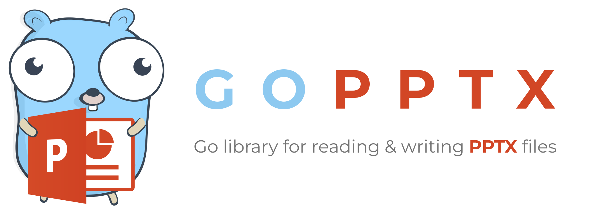

<p align="center"></p>

<p align="center">
    <a href="https://pkg.go.dev/github.com/kenny-not-dead/gopptx"></a>
    <a href="https://opensource.org/licenses/BSD-3-Clause"></a>
</p>

# GoPPTX

## Introduction

GoPPTX is a library written in pure Go providing a set of functions that allow you to write to and read from PPTX files. Supports reading and writing presentation documents generated by Microsoft PowerPoint&trade; 2007 and later. Supports complex components by high compatibility, and provided streaming API for generating or reading data from a presentation with huge amounts of data. This library needs Go version 1.24.0 or later. The full docs can be seen using go's built-in documentation tool, or online at [go.dev](https://pkg.go.dev/github.com/kenny-not-dead/gopptx).

## Basic Usage

### Installation

```bash
go get github.com/kenny-not-dead/gopptx
```
### Create presentation

The following constitutes the bare to create a presentation document.

```go
package main

import (
    "fmt"

	"github.com/kenny-not-dead/gopptx"
)

func main() {
	f := gopptx.NewFile()
    defer func() {
        if err := f.Close(); err != nil {
            fmt.Println(err)
        }
    }()

    err := f.SaveAs("presentation.pptx")
	if err != nil {
		fmt.Println(err.Error())

		return
	}
}
```

### Reading presentation

The following constitutes the bare to read a presentation document.

```go
package main

import (
    "fmt"

	"github.com/kenny-not-dead/gopptx"
)

func main() {
    f, err := excelize.OpenFile("presentation.pptx")
    if err != nil {
        fmt.Println(err)
        return
    }
    defer func() {
        // Close the presentation.
        if err := f.Close(); err != nil {
            fmt.Println(err)
        }
    }()
    // Get shapes from slide by given slude name.
	for _, slide := range f.Presentation.Slides.Slide {
		shapes, err := f.GetShapes(slide.ID)
		if err != nil {
			return
		}

		for _, shape := range shapes {
			fmt.Println(shape.TextBody)
		}
	}
}
```

## Contributing

Contributions are welcome! Open a pull request to fix a bug, or open an issue to discuss a new feature or change. XML is compliant with [part 1 of the 5th edition of the ECMA-376 Standard for Office Open XML](https://www.ecma-international.org/publications-and-standards/standards/ecma-376/).

## Licenses

This program is under the terms of the BSD 3-Clause License. See [https://opensource.org/licenses/BSD-3-Clause](https://opensource.org/licenses/BSD-3-Clause).

The PowerPoint logo is a trademark of [Microsoft Corporation](https://aka.ms/trademarks-usage). This artwork is an adaptation.

